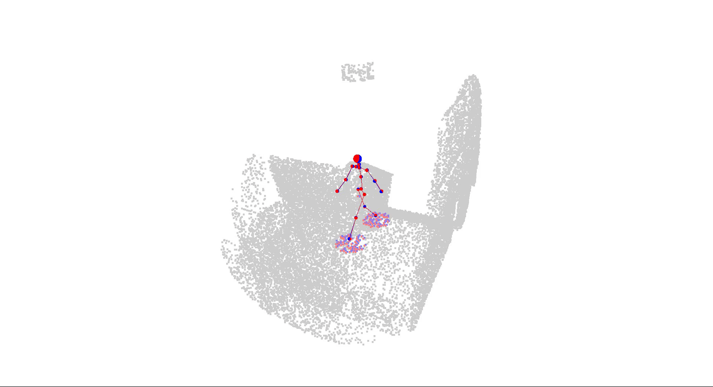
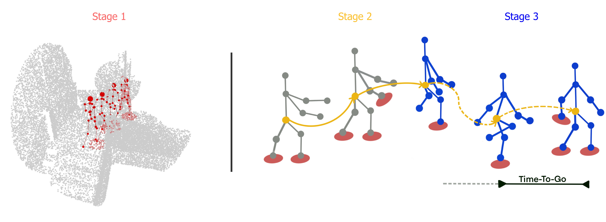

<div align="center">
<h1>Staged Contact-Aware Global Human Motion Forecasting (<b>BMVC2023 oral</b>)</h1>
<h3> <i>L. Scofano¹, A. Sampieri¹, E. Schiele², E. De Matteis¹</i></h3>
<h3> <i>L. Leal-Taixé², F. Galasso¹ </i></h3>
 <h4> <i>Sapienza University of Rome¹, Technical University of Munich²
</i></h4>




## Overview

We propose a STAGed contact-aware global human motion forecasting **STAG**, a novel three-stage pipeline for predicting global human motion in a 3D environment. We first consider the scene and the respective human interaction as contact points. Secondly, we model the human trajectory forecasting within the scene, predicting the coarse motion of the human body as a whole. The third and last stage matches a plausible fine human joint motion to complement the trajectory considering the estimated contacts.



</div>

## Setup

Run the following code to create an environment and install the required packages.

```bash
conda create -n stag
conda activate stag
```

```bash
pip install -r requirements.txt
```

## Datasets
### GTA-IM
To obtain the original dataset please contact the authors of [Long-term Human Motion Prediction with Scene Context](https://zhec.github.io/hmp/).

* *Data pre-process*. After downloading the original GTA-IM Dataset (the FPS-30 one), unzip every file and put it in the data foloder. Run the code below to process the dataset. 

```
python datasets/process_gta_dataset.py
```

The file structure of data folder should look like below. 

```
data
    ├── GTA-IM-Dataset
    │   ├── 2020-06-03-13-31-46
    │   │   ├── 0000.jpg
    │   │   ├── 0000.png
    │   │   ├── 0000_id.png
    │   │    ......          
    │   ├── 2020-06-04-23-14-02
    │    ......
    │   
    ├── data_v2_downsample0.02
    │   ├── 2020-06-04-23-14-02_r013_sf0.npz
    │   ├── 2020-06-04-23-08-16_r013_sf0.npz
    │   └── 2020-06-04-23-08-16_r013_sf1.npz
    └── 
```

## Usage

To train each stage of the pipeline, run the following code:

```bash
# Stage 1 -> contact points
python s1_cont_est_train.py --cfg gta_stage1_PVCNN2_DCT_CONT_GCN --is_amp --gpus 1
```


```bash
# Stage 2 -> Trajectory Forecasting
python s2_traj_train.py --cfg gta_stage2_TRAJ_GCN --is_amp --gpus 1
```


```bash
# Stage 3 -> Pose Forecasting
python s3_pose_train.py --cfg gta_stage3_GCN_POSE --is_amp --gpus 1
```

To test **STAG** run the following code:

```bash
# Using GT contact points
python s3_pose_test.py --cfg_cont gta_stage1_PVCNN2_DCT_CONT_GCN --cfg gta_stage3_GCN_POSE --iter 50 --iter_cont 50

# Using estimated contact points
python s3_pose_test.py --cfg_cont gta_stage1_PVCNN2_DCT_CONT --cfg gta_stage3_GCN_POSE --iter 50 --iter_cont 50 --w_est_cont
```

## Notes

- [ ] Include the code for the CU-Mocap dataset soon.
- [ ] Add the checkpoints for the models soon.


## Reference

```
@article{Scofano2023StagedCG,
  title={Staged Contact-Aware Global Human Motion Forecasting},
  author={Luca Scofano and Alessio Sampieri and Elisabeth Schiele and Edoardo De Matteis and Laura Leal-Taix'e and Fabio Galasso},
  journal={ArXiv},
  year={2023},
  volume={abs/2309.08947},
  url={https://api.semanticscholar.org/CorpusID:262043278}
}
```

## Acknowledgements

Our code is based on the following repositories:

- [Contact-aware Human Motion Forecasting](https://github.com/wei-mao-2019/ContAwareMotionPred)
- [Space-Time-Separable Graph Convolutional Network for Pose Forecasting](https://github.com/FraLuca/STSGCN)
